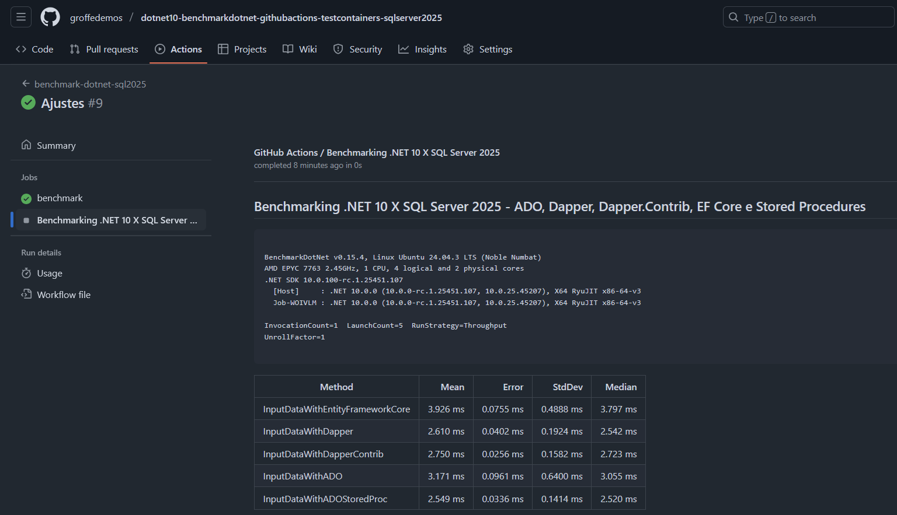

# dotnet10-benchmarkdotnet-githubactions-testcontainers-sqlserver2025
Workflow do GitHub Actions utilizando BenchmarkDotNet para avaliar a performance na inclusão de registros + Aplicação de testes que faz uso de .NET 10, Testcontainers, SQL Server 2025, Dapper, Dapper.Contrib, ADO, Stored Procedures e Entity Framework Core.

Exemplo de execução do workflow:

Action utilizada para publicação do relatório Markdown: https://github.com/marketplace/actions/markdown-report